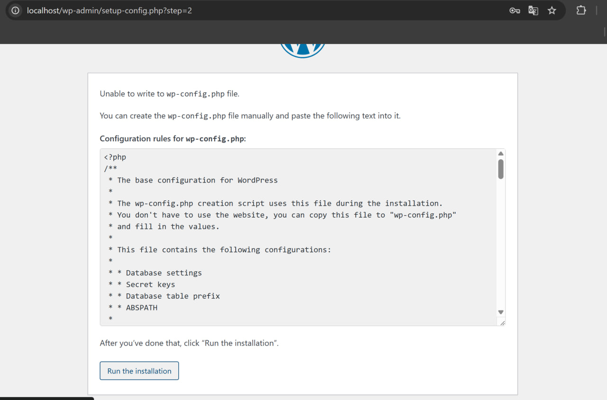

# Лабораторная работа №5. Запуск сайта в контейнере
 
 - **Калинкова София, I2302** 
 - **23.03.2025** 

## Цель работы

Выполнив данную работу студент сможет подготовить образ контейнера для запуска веб-сайта на базе Apache HTTP Server + PHP (mod_php) + MariaDB.

## Задание

Создать Dockerfile для сборки образа контейнера, который будет содержать веб-сайт на базе Apache HTTP Server + PHP (mod_php) + MariaDB. База данных MariaDB должна храниться в монтируемом томе. Сервер должен быть доступен по порту 8000.

Установить сайт WordPress. Проверить работоспособность сайта.

## Описание выполнения работы с ответами на вопросы

### Подготовка

Для выполнения данной работы необходимо иметь установленный на компьютере Docker.

Для выполнения работы необходимо иметь опыт выполнения лабораторной работы №3.

### Выполнение

1. Создаю репозиторий `containers05` и склонирую его себе на компьютер.


#### извлечение конфигурационных файлов apache2, php, mariadb из контейнера

Создаю в папке containers05 папку files, а также

- папку files/apache2 - для файлов конфигурации apache2;
- папку files/php - для файлов конфигурации php;
- папку files/mariadb - для файлов конфигурации mariadb.


Создаю в папке containers05 файл Dockerfile со следующим содержимым:

```
# create from debian image
FROM debian:latest

# install apache2, php, mod_php for apache2, php-mysql and mariadb
RUN apt-get update && \
    apt-get install -y apache2 php libapache2-mod-php php-mysql mariadb-server && \
    apt-get clean

```
Строю образ контейнера с именем `apache2-php-mariadb`.

`docker build -t apache2-php-mariadb .`


Создаю контейнер `apache2-php-mariadb` из образа `apache2-php-mariadb` и запускаю его в фоновом режиме с командой запуска bash.


`docker run -d --name apache2-php-mariadb apache2-php-mariadb bash`


Пояснение:

`-d` — запускает контейнер в фоновом режиме

`--name apache2-php-mariadb` — даёт контейнеру имя

`apache2-php-mariadb` — имя образа

`bash` — команда, которая будет выполняться в контейнере

Копирую из контейнера файлы конфигурации apache2, php, mariadb в папку files/ на компьютере. Для этого, в контексте проекта, выполняю команды:

```
docker cp apache2-php-mariadb:/etc/apache2/sites-available/000-default.conf files/apache2/
docker cp apache2-php-mariadb:/etc/apache2/apache2.conf files/apache2/
docker cp apache2-php-mariadb:/etc/php/8.2/apache2/php.ini files/php/
docker cp apache2-php-mariadb:/etc/mysql/mariadb.conf.d/50-server.cnf files/mariadb/
```

После выполнения команд в папке files/ должны появиться файлы конфигурации apache2, php, mariadb.


Останавливаю и удаляю контейнер `apache2-php-mariadb`.

```
docker stop apache2-php-mariadb
docker rm apache2-php-mariadb
```


### Настройка конфигурационных файлов

#### Конфигурационный файл apache2

Открываю файл `files/apache2/000-default.conf`, нахожу нужные строки из задания и меняю:
строку `#ServerName www.example.com` на `ServerName localhost`.

`ServerAdmin webmaster@localhost` на свой почтовый адрес.

После строки `DocumentRoot /var/www/html` добавляю следующие строки:

`DirectoryIndex index.php index.html`

Сохраняю файл и закрываю.


В конце файла `files/apache2/apache2.conf` добавляю следующую строку:

`ServerName localhost`


#### Конфигурационный файл php

Открываю файл `files/php/php.ini`, нахожу строку `;error_log = php_errors.log` и заменяю её на `error_log = /var/log/php_errors.log`.


Настраиваю параметры `memory_limit`, `upload_max_filesize`, `post_max_size` и `max_execution_time` следующим образом:

```
memory_limit = 128M
upload_max_filesize = 128M
post_max_size = 128M
max_execution_time = 120
```


Сохраняю файл и закрываю.

#### Конфигурационный файл mariadb

Открываю файл `files/mariadb/50-server.cnf`, нахожу строку `#log_error = /var/log/mysql/error.log` и раскомментирую её.


Сохраняю файл и закрываю.

#### Создание скрипта запуска

Создаю в папке `files` папку `supervisor` и файл `supervisord.conf` со следующим содержимым:

```
[supervisord]
nodaemon=true
logfile=/dev/null
user=root

# apache2
[program:apache2]
command=/usr/sbin/apache2ctl -D FOREGROUND
autostart=true
autorestart=true
startretries=3
stderr_logfile=/proc/self/fd/2
user=root

# mariadb
[program:mariadb]
command=/usr/sbin/mariadbd --user=mysql
autostart=true
autorestart=true
startretries=3
stderr_logfile=/proc/self/fd/2
user=mysql
```

#### Создание Dockerfile

Открываю файл `Dockerfile` и добавляю в него следующие строки:

после инструкции `FROM` ... добавляю монтирование томов:

```
# mount volume for mysql data
VOLUME /var/lib/mysql

# mount volume for logs
VOLUME /var/log
```

- в инструкции `RUN` ... добавляю установку пакета `supervisor`.

- после инструкции `RUN` ... добавляю копирование и распаковку сайта `WordPress`:

```
# add wordpress files to /var/www/html
ADD https://wordpress.org/latest.tar.gz /var/www/html/
```


- после копирования файлов `WordPress` добавляю копирование конфигурационных файлов `apache2, php, mariadb,` а также скрипта запуска:

```
# copy the configuration file for apache2 from files/ directory
COPY files/apache2/000-default.conf /etc/apache2/sites-available/000-default.conf
COPY files/apache2/apache2.conf /etc/apache2/apache2.conf

# copy the configuration file for php from files/ directory
COPY files/php/php.ini /etc/php/8.2/apache2/php.ini

# copy the configuration file for mysql from files/ directory
COPY files/mariadb/50-server.cnf /etc/mysql/mariadb.conf.d/50-server.cnf

# copy the supervisor configuration file
COPY files/supervisor/supervisord.conf /etc/supervisor/supervisord.conf
```

- для функционирования `mariadb ` создаю папку `/var/run/mysqld` и установливаю права на неё:

```
# create mysql socket directory
RUN mkdir /var/run/mysqld && chown mysql:mysql /var/run/mysqld
```
- открываю порт 80.

- добавьте команду запуска `supervisord`:

```
# start supervisor
CMD ["/usr/bin/supervisord", "-n", "-c", "/etc/supervisor/conf.d/supervisord.conf"]
```


Собераю образ контейнера:

`docker build -t apache2-php-mariadb .`

Запускаю контейнер в фоновом режиме:

`docker run -d --name apache2-php-mariadb -p 80:80 apache2-php-`


Проверяю файлы `WordPress` в контейнере

`docker exec -it apache2-php-mariadb ls /var/www/html/`

✅ Должен быть index.php и другие файлы WordPress.


Проверяю изменения в конфигурации `Apache2`

`docker exec -it apache2-php-mariadb cat /etc/apache2/sites-available/000-default.conf`

✅ Должно быть:

- ServerName localhost
- DirectoryIndex index.php index.html


#### Создание базы данных и пользователя

Создаю базу данных `wordpress` и пользователя `wordpress` с паролем `wordpress` в контейнере `apache2-php-mariadb`. Для этого, в контейнере `apache2-php-mariadb`, выполните команды:

`docker exec -it apache2-php-mariadb mysql -u root`
Затем внутри `MySQL` ввожу команды:

```
CREATE DATABASE wordpress;
CREATE USER 'wordpress'@'localhost' IDENTIFIED BY 'wordpress';
GRANT ALL PRIVILEGES ON wordpress.* TO 'wordpress'@'localhost';
FLUSH PRIVILEGES;
EXIT;

```


Создаю файл конфигурации `WordPress`

Открываю в браузере сайт `WordPress` по адресу http://localhost/. Указываю параметры подключения к базе данных:

имя базы данных: `wordpress`;
имя пользователя: `wordpress`;
пароль: `wordpress`;
адрес сервера базы данных: `localhost`;
префикс таблиц: `wp_`.



Копирую содержимое файла конфигурации в файл `files/wp-config.php` на компьютере.


### Добавление файла конфигурации WordPress в Dockerfile
Добавляю в файл `Dockerfile` следующие строки:

```
# copy the configuration file for wordpress from files/ directory
COPY files/wp-config.php /var/www/html/wordpress/wp-config.php
```


### Запуск и тестирование
Пересобераю образ контейнера с именем `apache2-php-mariadb` и запустите контейнер `apache2-php-mariadb` из образа `apache2-php-mariadb`. Проверьте работоспособность сайта `WordPress`.


**Ничего не поменялось :/**

В докерфайле меняю `COPY files/wp-config.php /var/www/html/wordpress/wp-config.php` на `COPY files/wp-config.php /var/www/html/wp-config.php`


:/

Вижу что моей БД вообще нет


Создаю БД и юзера опять, но с небольшими изменениями 
вместо `@'localhost'`  ` @'%'`


*В Docker MariaDB и WordPress работают в разных контейнерах, поэтому вместо 'localhost' используется '%', чтобы разрешить подключение с любого IP. Это позволяет WordPress корректно взаимодействовать с базой данных и избегать ошибки подключения.*
 как-то так :) 

После этого в браузере открывается welcome страница wordpress, заполняю все что требуется


### Ответы на вопросы:

1. Какие файлы конфигурации были изменены?

- 000-default.conf – изменён ServerName, ServerAdmin и добавлена DirectoryIndex.
- apache2.conf – добавлен ServerName localhost.
- php.ini – настроены параметры error_log, memory_limit, upload_max_filesize, post_max_size, max_execution_time.
- 50-server.cnf – раскомментирована строка log_error.
- wp-config.php – добавлены данные для подключения WordPress к базе.

2. За что отвечает инструкция DirectoryIndex в файле конфигурации apache2?

Эта инструкция определяет, какой файл будет загружаться первым при открытии папки в браузере
Например: `DirectoryIndex index.php index.html`
Это значит, что сервер сначала ищет index.php, а если его нет, загружает index.html.

3. Зачем нужен файл wp-config.php?

Этот файл хранит основные настройки WordPress, включая параметры подключения к базе (DB_NAME, DB_USER, DB_PASSWORD, DB_HOST). Без него WordPress не сможет работать с базой данных.

4. За что отвечает параметр post_max_size в файле конфигурации php?

Этот параметр устанавливает максимальный размер данных, которые можно отправить на сервер через POST-запрос. Влияет, например, на загрузку файлов и отправку больших форм.

5. Укажите, на ваш взгляд, какие недостатки есть в созданном образе контейнера?
- Контейнер объединяет веб-сервер и базу данных, что не соответствует лучшим практикам (лучше разделять их).

- Отсутствует механизм обновления и управления безопасностью.

- Не настроено автоматическое создание бэкапов базы данных.


## Вывод
В ходе работы был развёрнут контейнер с Apache, PHP и MariaDB, а также установлен и настроен WordPress. Создана база данных wordpress и пользователь с соответствующими правами..

Файл конфигурации wp-config.php был добавлен в контейнер через Dockerfile, после чего образ пересобран и запущен. В результате WordPress успешно установился и готов к использованию.

Работа позволила закрепить навыки работы с Docker, настройкой баз данных и веб-приложений в контейнерах. 

## Библиография
- Официальная документация Docker: https://docs.docker.com/get-started/overview/

- Руководство по Apache HTTP Server: https://httpd.apache.org/docs/2.4/

- Документация по PHP и настройкам ini: https://www.php.net/manual/en/ini.core.php

- База знаний MariaDB: https://mariadb.com/kb/en/mariadb-documentation/

- Инструкция по установке WordPress: https://wordpress.org/support/article/how-to-install-wordpress/

- Документация по Supervisor: http://supervisord.org/
